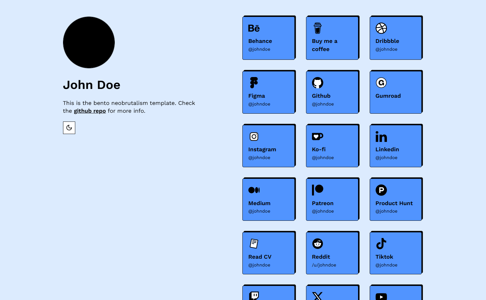

# Bento

Bento is a neobrutalism-styled nextjs tailwind template heavily insipired by bento.me.

## Get started

[Create a new repo](https://github.com/neobrutalism-templates/bento/generate) from this template.

### Installation

This template uses `pnpm` package manager so make sure you have it installed.

To install all dependencies run:

```bash
pnpm i
```

To run the app locally:

```bash
pnpm run dev
```

### Config

- Inside `layout.tsx` update the metadata
- Update the `favicon.ico` and `pfp.png` (profile picture)
- Inside `page.tsx` update the content

#### Links config

Inside `links.ts` inside `LINKS` object, every property represents a link displayed on the home page. Leave only the links you wanna show.

#### Link object

```ts
github: {
  title: 'Github',
  icon: github,
  link: 'https://github.com/johndoe',
  text: '@johndoe',
},
```

`title` and `text` are being displayed on the link, `link` is self-explanatory, and `icon` is svg icon imported from `public/icons`. Do not touch `icon` unless you want to have different icons than the default ones.

### Styling

To change the styling visit [styling docs](https://neobrutalism-components.vercel.app/docs/styling), and copy the desired styling to tailwind config like it's shown in the styling docs.
